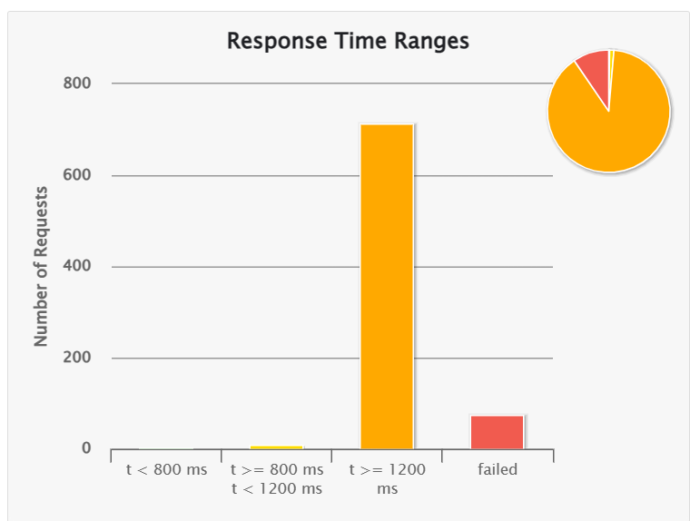
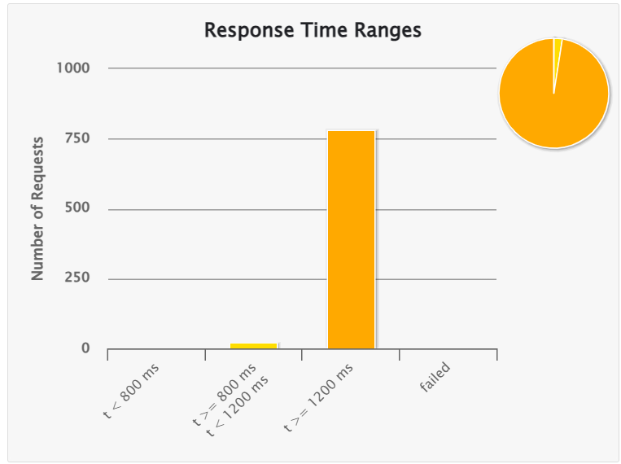
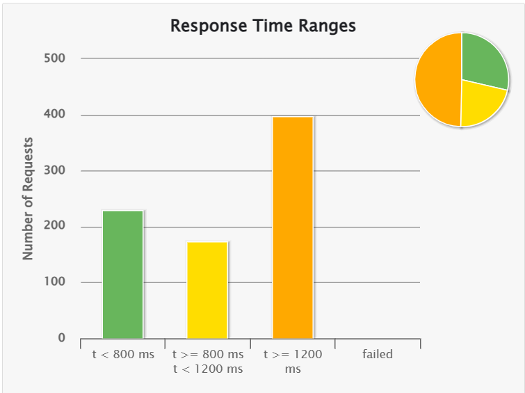
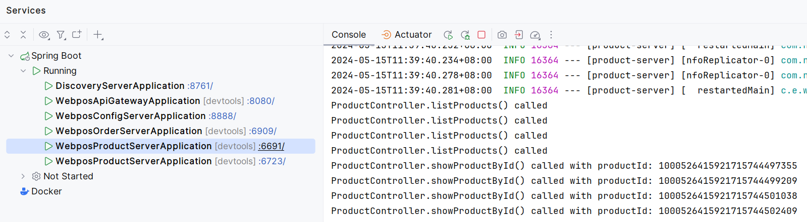
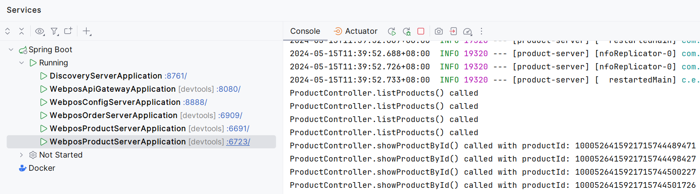

[](https://classroom.github.com/a/IMEm063v)
# Micro WebPoS 

### 实现功能
基本功能与上上一实验基本一致，在此不做赘述，主要是讲上一实验的功能拆分为各个服务，然后在此基础上进行微服务化改造。

实现了独立的Product server、Order server、Discovery server、Api gateway以及Config server

其中Product server和Order server的功能由aw05的代码拆分改造后得到，Order server还调用了Product server的接口。调用过程使用了FeignClient。

Discovery server使用了Eureka Server，用于服务注册与发现。

Gateway server使用了Spring Cloud Gateway，用于服务网关。

Config server使用了Spring Cloud Config，用于配置管理。配置采用本地存储，放置在/src/main/resources/config文件夹下。

依旧采用了docker-compose进行微服务的部署，

构建镜像指令：
```
docker compose build
```
启动程序指令：
```
docker compose up
```

### 压力测试
为了验证系统的可伸缩性，我们对系统进行了压力测试。

测试使用Gatling进行，每次并发用户数为800，测试结果如下

一个product server时：


两个product server时：


三个product server时：


可以显著的看出，随着product server的增加，系统的吞吐量和响应时间都有明显的提升。

也就是微服务的部分服务进行水平向扩展是可以提升整个系统的整体性能的。

### 验证Client-side LB可行性
在网关处配置Client-side LB策略，将请求转发到相应的微服务。根据log后添加的timestamp，可以看到请求被均匀的分配到各个微服务中。

